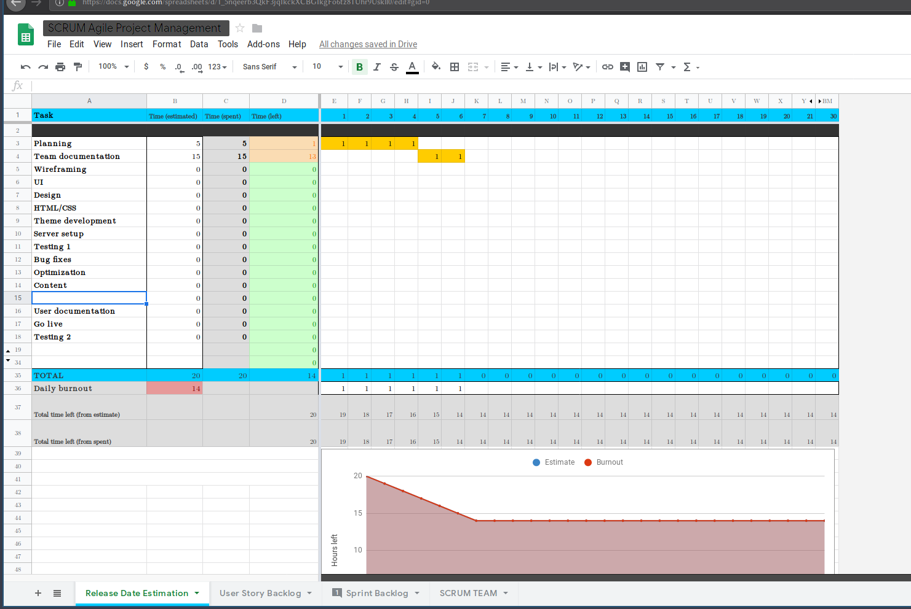
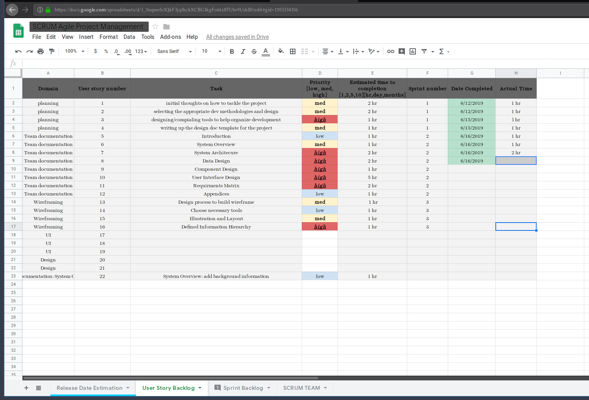

# Read me

---

We understand the assignment as it is presented.
To accomplish the assignment we have been using a few tools to aid in communication and development.
We are using [Discord][discord] (A voice chat app) to communicate and share ideas.
We are using [google drive][drive] to share larger files and type up documents.
We are going to use [github][github] to handle our version control for are app and svn for version control on the documents after they move out of the google drive.
The methodologies and stack we have decided the SCRUM and Test driven development.
This will allow for quick development cycles and a defined set of tasks.
We have also decided to go with a MEAN stack for the speed of development and the fact that it is open source.
There is also a great deal of documentation over each of its components.

We have already set up and used the SCRUM tools to complete assignment one and will continue to as we work through our stack.

[discord]: https://discord.gg/qWkuATE
[drive]: https://drive.google.com/drive/folders/1Uj9bAcDKCYKBeOmRN-0SbxXCYawGB2ad?usp=sharing
[github]: https://github.com/conrad760/SoftwareDesign
